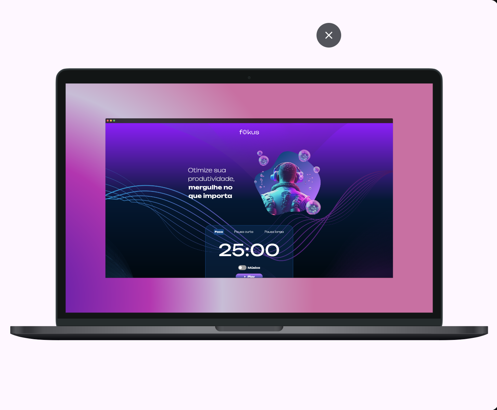

# 🧠 Timer Web - Temporizador de Produtividade

**Timer Web** é uma versão web responsiva do aplicativo de produtividade baseado na técnica **Pomodoro**. Desenvolvido com **Flutter Web**, oferece uma experiência imersiva diretamente no navegador, com ciclos de foco e pausas para melhorar sua concentração e performance.

<p align="center">
  
  
  
</p>

---

## ✨ Funcionalidades

- ⏱ **Temporizador Pomodoro** com 3 modos:
  - Foco (25 minutos)
  - Pausa curta (5 minutos)
  - Pausa longa (15 minutos)
- 🌐 Totalmente acessível via navegador
- 🎨 Interface com visual moderno, minimalista e responsivo
- 🧘‍♂️ Frases motivacionais e imagens para imersão no foco
- 🔊 Alarme sonoro ao final do ciclo (opcional)
- 🎵 Modo música ativável com `switch`
- 🕹️ Botão com estados dinâmicos: Play / Pause / Restart

---

## 💻 Acesse agora

> 🌍 **[Clique aqui para acessar o app online](https://mateusheberle.github.io/timer-web/)**

---

## 📱 Tecnologias utilizadas

- **Flutter Web** (Dart)
- `Timer` para controle de tempo
- `just_audio` para áudio
- `flutter_switch` para alternância de música
- Layout responsivo com `LayoutBuilder` e breakpoints customizados

---

## 🚀 Como rodar localmente

1. Clone o repositório:

```bash
git clone https://github.com/mateusheberle/timer-web.git
cd timer-web
```

2. Instale as dependências:

```bash
flutter pub get
```

3. Rode no navegador:

```bash
flutter run -d chrome
```

---

## 📁 Estrutura do projeto

```
lib/
├── main.dart
├── pages/
│   └── home_page.dart
├── components/
│   ├── categoria.dart
│   ├── button.dart
├── theme/
│   ├── app_colors.dart
│   └── typography.dart
├── consts.dart
assets/
├── Imagens/
├── Logo/
└── Sons/
```

---

## 💡 Inspiração

Inspirado por apps como **Forest**, **Focus To-Do** e técnicas de **imersão em foco**.

> “Concentre-se no que importa. O resto pode esperar.”

---

## 📃 Licença

Este projeto é open source sob a licença MIT. Veja o arquivo [LICENSE](LICENSE) para mais detalhes.

---

## 👨‍💻 Autor

Desenvolvido por **Mateus Auler Heberle**  
🌍 Itapema - SC | 🇧🇷  

---

Se quiser, posso gerar o `README.md` em Markdown direto pra você copiar/colar, ou salvar num arquivo. Quer isso?